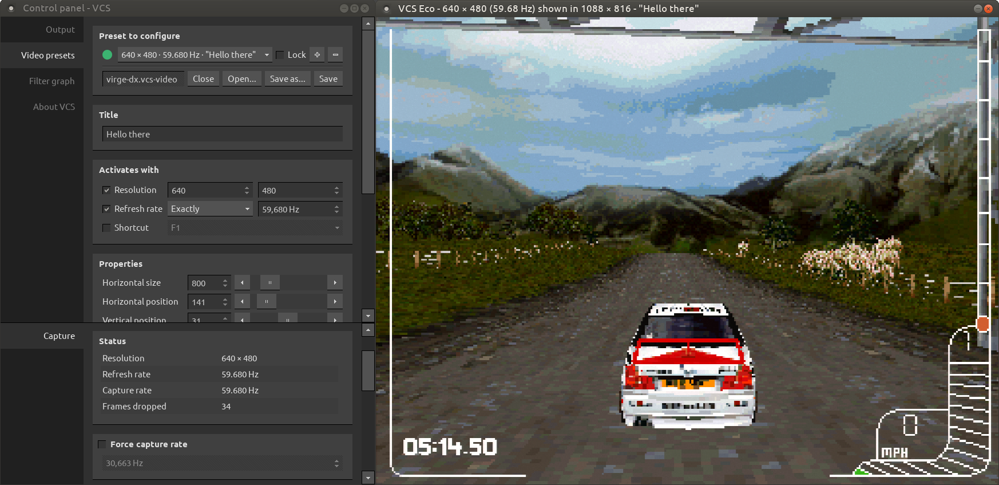
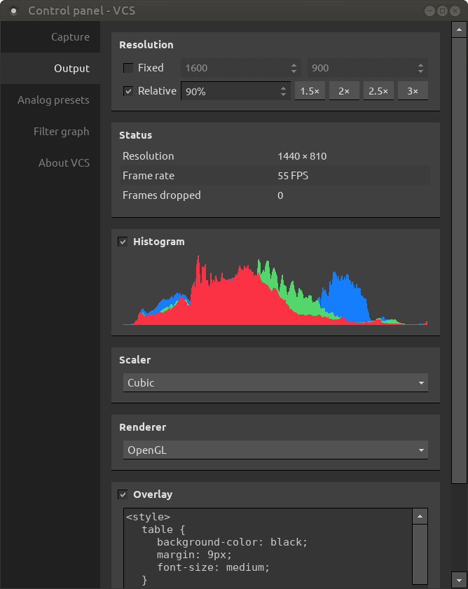

# Some words for the end-user about VCS

1. [Introduction](#introduction)
    1. [Key features](#key-features)
    2. [Supported capture hardware](#supported-capture-hardware)
    3. [System requirements](#system-requirements)
2. [FAQ](#faq)
    1. [Where can I download VCS?](#q-where-can-i-download-vcs)
    2. [What to do if there's no signal?](#q-what-to-do-if-theres-no-signal)
    3. [How do I adjust the picture?](#q-how-do-i-adjust-the-picture)
    4. [How do I fix analog noise?](#q-how-do-i-fix-analog-noise)
    5. [How do I set the correct capture resolution?](#q-how-do-i-set-the-correct-capture-resolution)
    6. [How do I change the aspect ratio?](#q-how-do-i-change-the-aspect-ratio)
    7. [How do I enable variable refresh rate output?](#q-how-do-i-enable-variable-refresh-rate-output)
    8. [How do I fix screen tearing?](#q-how-do-i-fix-screen-tearing)
    9. [How much capture latency is there?](#q-how-much-capture-latency-is-there)
3. [The user interface](#the-user-interface)
    1. [Output window](#output-window)
    2. [Control panel](#control-panel)
4. [Image filters](#image-filters)
    1. [3-by-3 kernel](#3-by-3-kernel)
    2. [Anti-tear](#anti-tear)
    3. [Blur](#blur)
    4. [Color depth](#color-depth)
    5. [Crop](#anti-tear)
    6. [Decimate](#decimate)
    7. [Flip](#flip)
    8. [Focus peaking](#focus-peaking)
    9. [Line copy](#line-copy)
    10. [Rotate](#rotate)
    11. [Sharpen](#sharpen)
    12. [Source FPS](#source-fps)
    13. [Temporal denoise](#temporal-denoise)
5. [Keyboard and mouse controls](#keyboard-and-mouse-controls)
6. [Command-line options](#command-line-options)

# Introduction

VCS is an [open-source](https://github.com/leikareipa/vcs) control application for Datapath Vision capture cards on Linux.



## Key features

- Unlimited video presets for analog capture
- Several scaling modes and image filters
- Variable refresh rate output

## Supported capture hardware

Any model of Datapath capture card supported by the Datapath Vision driver for Linux should be compatible, although the card's full set of capabilities may not be exposed.

## System requirements

<table>
    <tr>
        <th>OS</th>
        <td>A version of Linux supported by Datapath's Vision Linux driver</td>
    </tr>
    <tr>
        <th>CPU</th>
        <td>Intel Sandy Bridge or equivalent (Coffee Lake or better recommended)</td>
    </tr>
    <tr>
        <th>GPU</th>
        <td>
            For optional hardware rendering, an OpenGL 1.2 compatible graphics card
        </td>
    </tr>
    <tr>
        <th>RAM</th>
        <td>VCS will use up to 1 GB of RAM</td>
    </tr>
</table>

# FAQ

## Q: Where can I download VCS?

**A**: VCS is available from GitHub: https://github.com/leikareipa/vcs/. Pre-built binaries may not be available.

## Q: What to do if there's no signal?

**A**: If the capture card ought to be receiving a signal but VCS shows a blank window and/or says "No signal," it may be caused by one of the following:

1. The Datapath Vision Linux driver hasn't been installed for your kernel. You need to reinstall the driver whenever the kernel is updated.
2. The signal is out of range, i.e. it's of an unsupported resolution or refresh rate. VCS itself has a maximum input resolution of 4096 &times; 4096; and for example the Datapath VisionRGB-E1S capture card has a maximum digital input resolution of 1920 &times; 1200.
3. Your capture source may have gone into hibernation and isn't actually sending a signal.
4. Something else, a mystery in the shadows. Try restarting the Datapath Vision Linux driver module (*$ sudo modprobe -r rgb133 && sudo modprobe rgb133*), or reinstalling the driver entirely.

## Q: How do I adjust the picture?

**A**: There are three complementary ways to control how captured frames are displayed.

1. To adjust analog video properties, access Control panel &rarr; Video presets.
2. To scale the output image, see Control panel &rarr; Output.
3. To force a different input resolution, see Control panel &rarr; Capture.

With analog capture, you may at times find it seemingly impossible to get the picture centered perfectly, especially on the vertical axis. This is a capture hardware limitation that can't be fixed from VCS. But you may be able to adjust the signal on the capture source &ndash; for example, if capturing a Windows PC, you can use the PowerStrip software to fine-tune the output timings for each video mode you intend to capture.

## Q: How do I fix analog noise?

**A**: In an analog signal, some amount of visual noise is always present, so VCS comes with a few ways to mitigate it.

1. See that your analog settings are correct, by accessing Control panel &rarr; Analog presets. You'll want to ensure that the *Horizontal size* and *Phase* parameters in particular are set to suitable values.
2. Use a denoising filter via Control panel &rarr; Filter graph.
3. When capturing a pixel-doubled signal (e.g. some VGA modes), use a decimating filter to remove sub-pixel noise.

## Q: How do I set the correct capture resolution?

**A**: Sometimes the capture hardware fails to automatically determine the correct input resolution for the captured signal. You can help it by manually overriding the resolution via Control panel &rarr; Capture.

## Q: How do I change the aspect ratio?

**A**: There are two ways to control the output aspect ratio.

1. Set a fixed output resolution via Control panel &rarr; Output.
2. Use an output scaling filter via Control panel &rarr; Filter graph. This method allows optional letterboxing.

## Q: How do I enable variable refresh rate output?

**A**: VCS always outputs at the rate of capture, provided that your hardware can keep up.

If your monitor has variable refresh rate support, the rate you see will match the refresh rate of your capture source. For some implementations, you may need to adjust the settings in VCS to enable OpenGL rendering and/or fullscreen mode.

## Q: How do I fix screen tearing?

**A**: While VCS itself doesn't cause screen tearing, it may be present in captured frames. To reduce or even eliminate this kind of tearing, use the Anti-tearing filter via Control panel &rarr; Filter graph.

## Q: How much capture latency is there?

**A**: Compared to routing your video output directly into a monitor, there should be about a dozen milliseconds of extra latency, provided that you meet [VCS's recommended system requirements](#system-requirements).

# The user interface

The UI of VCS has two main components: the output window, where captured frames are displayed; and the control panel, where you can adjust various operating parameters.

## Output window


The output window displays captured frames after any scaling and image filtering has been applied to them.

### Magnifying glass 

Press the middle mouse button over the window to bring up a magnifying glass that shows an enlarged view of the output image.

This feature isn't available when using the OpenGL renderer.

### Fullscreen mode

Double-click the window to enable fullscreen mode, or select *Fullscreen* from the [context menu](#context-menu). Double-click or press Esc to exit fullscreen mode.

The aspect ratio of fullscreen mode can be customized via the [control panel](#control-panel).

### Resizing

The size of the window can be scaled up and down with the mouse scrollwheel. More accurate control is available via Control panel &rarr; Output.

### Context menu

Right-click the window to bring up a context menu that provides access to various settings.

## Control panel



The control panel lets you adjust various operational aspects of VCS.

To access the control panel, press ALT+Q or select *Control panel* from the output window's [context menu](#context-menu).

# Image filters

The filter graph, accessible via the [control panel](#control-panel), provides access to various image filters.

## 3-by-3 kernel

Applies a custom 3 &times; 3 convolution kernel to the input image.

## Anti-tear

Given a sequence of input images, attempts to detect and correct screen tearing in them.

## Blur

Blurs the input image. You can choose between box blur and Gaussian blur.

### Parameters

- **Type**

    The type of blur to apply. Available types: box blur, Gaussian blur.

    Box blur is faster to compute but can look worse than Gaussian blur.

- **Radius**

    The amount of blur to apply, in the range [0.1, 99].

    Higher values require more compute.

## Color depth

Manipulates the color depth of the input image by decreasing the bit count for each color channel.

By default, all channels have 8 bits of precision.

### Parameters

- **Red**

    The number of bits to use for the red channel, in the range [1, 8].

- **Green**

    The number of bits to use for the green channel, in the range [1, 8].

- **Blue**

    The number of bits to use for the blue channel, in the range [1, 8].

## Crop

Crops the input image to a specified region and optionally blows up the result.

### Parameters

- **XY**

    The X and Y coordinates of the top-left corner of the crop region.

- **Size**

    The width and height of the crop region.

- **Scaler**

    The scaling method to use after cropping.

    | Method  | Description                                                                                                                           |
    | ------- | ------------------------------------------------------------------------------------------------------------------------------------- |
    | None    | No scaling is applied. The cropped region will retain its original size, and black borders will be added to fill the remaining space. |
    | Nearest | Scaling with nearest-neighbor interpolation.                                                                                          |
    | Linear  | Scaling with bilinear interpolation.                                                                                                  |

## Decimate

Reduces the apparent resolution of the input image, without changing its actual resolution.

### Parameters

- **Factor**

    The decimation factor, which determines how much the image resolution is reduced.

- **Sampler**

    The method used to interpolate pixel values.

    | Method  | Description                     |
    | ------- | ------------------------------- |
    | Nearest | Nearest-neighbor interpolation. |
    | Average | Bilinear interpolation.         |

## Flip

Flips the input image along a specified axis.

### Parameters

- **Axis**

    The axis along which to flip the image.

    | Value      | Description                                       |
    | ---------- | ------------------------------------------------- |
    | Vertical   | Flips the image vertically (top to bottom).       |
    | Horizontal | Flips the image horizontally (left to right).     |
    | Both       | Flips the image both vertically and horizontally. |

## Focus Peaking

Highlights areas of the image that are in sharp focus, helping to identify which parts of the image are most detailed.

### Parameters

- **Color**

    The color of the focus peaking overlay. Color values are in the range [0, 255].

- **Threshold**

    Determines the sensitivity of the focus peaking effect. Range: [0-255].

## Line copy

Copies a line (row or column) of pixels from one part of the image to another.

## Median

Applies a median filter to the input image.

### Parameters

- **Radius**

    The radius of the median filter. Range: [0, 99].

    Larger values require more compute.

## Rotate

Rotates the input image.

### Parameters

- **Angle**

    The angle of rotation, in degrees in the range [-360, 360].

- **Scale**

    The scaling factor, in the range [0.01, 20], where 1 means no scaling.

## Sharpen

Applies a 3 &times; 3 sharpening kernel to the input image.

```
 0, -1,  0,
-1,  5, -1,
 0, -1,  0
```

## Source FPS

Given a sequence of input images, displays a FRAPS-like count of unique frames per second.

### Parameters

- **Row**

    If enabled, pixel differences will be compared along a single horizontal row rather than over the entire image. The value determines which row is used, such that 0 is the top-most row.

    A single-row comparison is more accurate when the frame rate of the source doesn't match its output frequency, i.e. when there's screen tearing.

- **Threshold**

    The minimum difference in pixel values between successive images to consider them as two unique images. Range: [0, 255].

    A value of 0 gives in the most accurate reading, but the presense in the images of e.g. analog noise will require a higher value.

- **Position**

    Where in the image to display the FPS counter.

- **Visualize**

    Show debug indicators to help you determine how the filter is operating.

## Temporal denoise

Reduces time-variant noise in sequences of input images by suppressing changes in pixel values unless they exceed a threshold.

Effective in suppressing analog grain.

Note that this filter only reduces the temporal aspect of the noise; it doesn't denoise discrete images.

### Parameters

- **Strength**

    The threshold which pixel deltas have to exceed in order for the change to become visible. Range: [0, 255].

    Higher values result in greater reduction of temporal noise but increased artefacting.

# Keyboard and mouse controls

## App-wide

<table>
    <tr>
        <th>Key(s)</th>
        <th>Description</th>
    </tr>
    <tr>
        <td><key-combo>F1</key-combo> to <key-combo>F12</key-combo></td>
        <td>Activate an analog video preset, if one is bound to this key.</td>
    </tr>
    <tr>
        <td><key-combo>Alt+Q</key-combo></td>
        <td>Open the Control panel.</td>
    </tr>
    <tr>
        <td><key-combo>Alt+S</key-combo></td>
        <td>Save the current output image to disk.</td>
    </tr>
    <tr>
        <td><key-combo>Ctrl+Shift+F</key-combo></td>
        <td>Toggle the filter graph on/off.</td>
    </tr>
    <tr>
        <td><key-combo>Ctrl+Shift+O</key-combo></td>
        <td>Toggle the overlay on/off.</td>
    </tr>
    <tr>
        <td><key-combo>Ctrl+1</key-combo> to <key-combo>Ctrl+9</key-combo></td>
        <td>
            Activate the corresponding resolution button in Control panel &rarr; Capture &rarr; Force resolution. The layout of the shortcut keys is that of the numpad, such that e.g. Ctrl+7 activates the top left button.
        </td>
    </tr>
    <tr>
        <td><key-combo>Shift+1</key-combo><br><key-combo>Shift+2</key-combo></td>
        <td>Switch between /dev/video0 and /dev/video1.</td>
    </tr>
</table>

## Output window

<table>
    <tr>
        <th>Key(s)</th>
        <th>Description</th>
    </tr>
    <tr>
        <td><key-combo>Esc</key-combo></td>
        <td>Exit fullscreen mode.</td>
    </tr>
</table>

## Control panel

<table>
    <tr>
        <th>Key(s)</th>
        <th>Description</th>
    </tr>
    <tr>
        <td><key-combo>Right click</key-combo></td>
        <td>When done over the left-hand tab buttons, splits the control panel into two views.</td>
    </tr>
</table>

### Capture

<table>
    <tr>
        <th>Key(s)</th>
        <th>Description</th>
    </tr>
    <tr>
        <td><key-combo>Alt+Left click</key-combo></td>
        <td>When done over the "Force resolution" buttons, allows you to customize the button's resolution.</td>
    </tr>
</table>

### Video presets

<table>
    <tr>
        <th>Key(s)</th>
        <th>Description</th>
    </tr>
    <tr>
        <td><key-combo>Alt+Left click</key-combo></td>
        <td>When done over the "+" button, creates a new preset whose settings are copied from the currently-selected preset. (Clicking the button without holding Alt creates a new preset with default settings.)</td>
    </tr>
</table>

The above isn't an exhaustive list.

# Command-line options

<table>
    <tr>
        <th>Option</th>
        <th>Description</th>
    </tr>
    <tr>
        <td>-i <i>&lt;integer&gt;</i></td>
        <td>
            Start capture on the given input channel. On Linux, this would be <em>/dev/videoX</em>.
        </td>
    </tr>
    <tr>
        <td>-v <i>&lt;string&gt;</i></td>
        <td>
            Load video presets from the given file on start-up. Video preset files typically have the .vcs-video suffix.
        </td>
    </tr>
    <tr>
        <td>-f <i>&lt;string&gt;</i></td>
        <td>
            Load a custom filter graph from the given file on start-up. Filter graph files typically have the .vcs-filter-graph suffix.
        </td>
    </tr>
</table>
